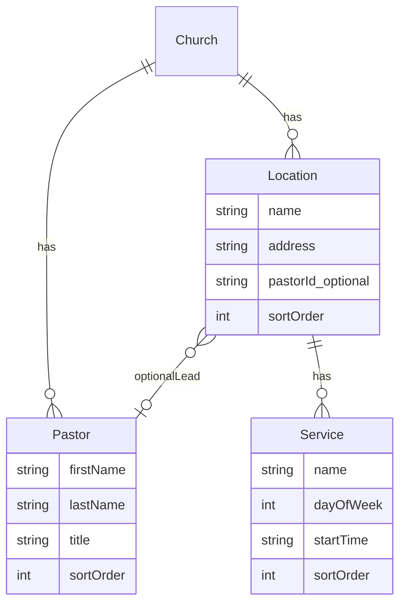

# Self-serve church signup wizard

## Decisions locked in

- **Surface:** New authenticated wizard at `/onboard` (not the engineer `/dev` form).
- **Service shape:** name + day of week + start time (no end time / notes in this pass).
- **Pastor ↔ location:** optional single pastor per location (via client temp keys during create).

## Data model

Add three models in [`packages/database/prisma/schema.prisma`](packages/database/prisma/schema.prisma), related from `Church`:

- `Service.dayOfWeek`: `0–6` (Sunday–Saturday), matching JS `Date.getDay()`.
- `Service.startTime`: `"HH:mm"` 24h string in the church timezone (keep `Church.timezone` as-is; no per-location timezone yet).
- Keep existing `Church.address` untouched for now (legacy single field); locations are the multi-campus source of truth going forward.
- Leave `/dev` `church.create` unchanged; it does not require pastors/locations.

Run Prisma migrate after schema change.

## API

Add a **protected** (not `devProcedure`) mutation in [`packages/api/src/routers/church.ts`](packages/api/src/routers/church.ts):

`church.onboard` — creates church + nested records + `OWNER` membership for the signed-in user in one transaction.

Input sketch:

- Church: `slug`, `name`, `tagline?`
- `pastors[]`: `{ clientKey, firstName, lastName, title }`
- `locations[]`: `{ name, address, pastorClientKey?, services: [{ name, dayOfWeek, startTime }] }`

Rules:

- At least one pastor and one location required for a complete onboard (services optional per location, but UI encourages adding at least one).
- Slug uniqueness conflict → `CONFLICT`.
- Resolve `pastorClientKey` → real `pastorId` after pastors are created.
- Do not auto-provision Vercel/mobile in this pass.

Optionally expose pastors/locations/services on `getPublicSite` later; **out of scope** for this pass unless needed for the wizard confirmation screen.

## Wizard UX

New route: [`apps/web/src/app/onboard/page.tsx`](apps/web/src/app/onboard/page.tsx) (+ small step components under `apps/web/src/components/onboard/`).

**Auth flow:**

1. [`/signup`](apps/web/src/app/signup/page.tsx) stays account-only; after successful register + `signIn`, redirect to `/onboard` instead of `/dashboard`.
2. `/onboard` requires session; if unauthenticated → `/login?callbackUrl=/onboard`.
3. If user already owns/belongs to a church, show a short “you already have a church” state with link to dashboard (avoid duplicate creates for v1; one church per onboard).

**Steps (single composition, step indicator, Back/Continue):**

1. **Church** — name, slug (auto from name, editable), optional tagline
2. **Pastors** — repeatable rows: first name, last name, title; add/remove
3. **Locations** — repeatable campuses: name, address; optional pastor select from step 2; nested **Services** per location: name, day, start time; add/remove services
4. **Review** — summary → Submit → `church.onboard` → redirect `/dashboard`

Match existing web UI primitives (`Button`, `Input`, `Label`, cards only where they group interactive form sections). Keep styling consistent with signup/dashboard (ink/brand tokens), not a new marketing look.

Client-held draft state across steps (React state or a tiny context); submit only on the final step.

## Seed / docs (light)

- Extend [`packages/database/prisma/seed.ts`](packages/database/prisma/seed.ts) for `grace` with 1–2 pastors, 2 locations, a couple of Sunday services so local data matches the model.
- No README overhaul unless signup redirect needs a one-line note.

## Out of scope (explicit)

- Engineer `/dev` form parity for pastors/locations
- Church-site / native display of campuses & service times
- Editing pastors/locations after create
- Website auto-provision on onboard
