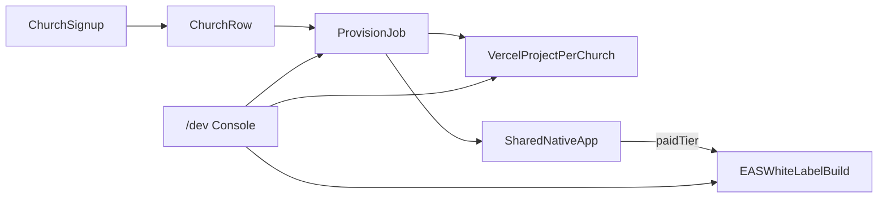

# Church website + mobile rollout

## Decisions locked in

| Surface     | Choice                                                                                   |
| ----------- | ---------------------------------------------------------------------------------------- |
| Websites    | **Separate Next.js deploy per church** (Vercel project each)                             |
| Mobile      | **Hybrid**: shared App Store app by default; white-label EAS builds for paid churches    |
| `/dev` gate | **Env email allowlist** (no DB column) — same pattern as `/admin`, different auth source |

You already have the foundation: `Church` + branding in Prisma, native runtime tenancy + `EXPO_PUBLIC_TENANT` build hooks, platform `/admin` via `User.isAdmin`. What’s missing is **onboarding → provision → deploy lifecycle**.

---

## Landscape (why these choices, and alternatives we are not taking)

### Church websites

| Approach                                                     | Pros                                                                                  | Cons                                                                |
| ------------------------------------------------------------ | ------------------------------------------------------------------------------------- | ------------------------------------------------------------------- |
| **A. Multi-tenant one Next.js app** (`slug.churchstack.com`) | Cheapest ops, one deploy, instant “sites”                                             | Weak isolation; customizations bleed; harder “their own site” story |
| **B. Separate Next.js deploy per church (chosen)**           | Real isolation, custom domains, per-church code/theme overrides, independent rollouts | Cost/project sprawl; need automation; template-upgrade story        |
| **C. Static export / CMS-only**                              | Simple hosting                                                                        | Weak for auth, giving, live events; fights Next.js app model        |

**Within B, how we generate deploys:**

| Sub-approach                                            | Pros                                                                           | Cons                                                                       |
| ------------------------------------------------------- | ------------------------------------------------------------------------------ | -------------------------------------------------------------------------- |
| **Template app in monorepo + Vercel API** (recommended) | One source of truth with `@repo/*`; typed branding; `/dev` can trigger deploys | Vercel monorepo root-directory config per project; careful Turbo filtering |
| Forked GitHub repo per church                           | Max customization                                                              | Drift hell; nearly impossible to push platform updates                     |
| Docker/container per church                             | Cloud-agnostic                                                                 | You own orchestration, TLS, scaling — heavier than Vercel for now          |

**Recommendation:** Add `apps/church-site` (Next.js church public site template). On provision, create a Vercel project pointed at that app directory, with env `CHURCH_SLUG` (and shared API/`DATABASE_URL` as needed). Custom domain attached via Vercel Domains API.

### Mobile

| Approach                 | Pros                              | Cons                                                                 |
| ------------------------ | --------------------------------- | -------------------------------------------------------------------- |
| Shared app only          | One listing, already mostly built | Churches want “our app” branding in stores                           |
| White-label every church | Strong product story              | Apple/Google review tax, certs, cost                                 |
| **Hybrid (chosen)**      | Default cheap; upsell clear       | Two pipelines to maintain; `/dev` must show which churches are which |

Native already supports both modes via [`apps/native/app.config.ts`](apps/native/app.config.ts) (`EXPO_PUBLIC_TENANT` + bundle IDs). Work is productization: plans, EAS profiles, asset pipeline, `/dev` triggers—not greenfield architecture.

### `/dev` gating (no DB flag)

| Approach                                         | Pros                                                        | Cons                                                                      |
| ------------------------------------------------ | ----------------------------------------------------------- | ------------------------------------------------------------------------- |
| **`PLATFORM_DEV_EMAILS` env allowlist** (chosen) | Zero schema cost; rotate via env; works for 1–few engineers | Redeploy to change list; email must match Auth.js session                 |
| New `isDev` DB column                            | UI-togglable                                                | Overkill for one person                                                   |
| Reuse `isAdmin` for `/dev`                       | Already exists                                              | Conflates product admin with engineer tools; future hire breaks the model |
| Secret URL / basic auth                          | Simple                                                      | Weak; easy to leak                                                        |

**Implementation:** `requireDev()` mirrors [`require-admin.ts`](apps/web/src/lib/require-admin.ts): require session, then `PLATFORM_DEV_EMAILS.split(',').includes(session.user.email)`. Non-matches get **404** (same as admin). Locally, allow all signed-in users when `NODE_ENV=development` _or_ when the allowlist is empty and `ALLOW_DEV_CONSOLE=true`—pick one rule and document it in `.env.example`.

---

## Target architecture

### 1. Data model additions (on `Church`)

Keep branding where it is; add **provisioning state** (not a second tenant system):

- `websiteStatus`: `NONE | PENDING | DEPLOYING | LIVE | FAILED`
- `websiteUrl`, `customDomain` (nullable)
- `vercelProjectId`, `vercelDeploymentId` (nullable, ops metadata)
- `mobilePlan`: `SHARED | WHITELABEL`
- `mobileBuildStatus`: `NONE | QUEUED | BUILDING | SUBMITTED | LIVE | FAILED` (for white-label only)
- Optional later: `easProjectId`, store listing IDs

Church **create** API still missing today—[`auth.register`](packages/api/src/routers/auth.ts) only creates users; admin is read-only. Provisioning starts when a church row is created (self-serve onboarding or `/dev` “Create church”).

### 2. `apps/church-site` — per-church Next.js template

- Public marketing/site for one church: home, events, sermons, give (feature-flagged via existing `Church` flags).
- Resolves tenant from `CHURCH_SLUG` env (not host multi-tenancy)—each Vercel project is locked to one church.
- Reuses `@repo/api` / `@repo/config` / branding helpers; talks to the same API as `apps/web`.
- Platform SaaS site stays in [`apps/web`](apps/web) (marketing, signup, dashboard, `/admin`, `/dev`).

### 3. Provisioner service (API + job)

Triggered by: church signup completion, `/dev` “Provision website”, or admin “Activate”.

Steps for website:

1. Ensure `Church` row + `OWNER` membership
2. Set `websiteStatus=PENDING`
3. Call Vercel API: create project → set env (`CHURCH_SLUG`, `NEXTAUTH_*` if needed, API URL) → deploy from monorepo `apps/church-site`
4. Optionally attach subdomain `slug.sites.churchstack.com` first; custom domain later
5. Persist IDs/URL; mark `LIVE` or `FAILED`

For mobile (default): no build—church appears in shared app via existing `church.list` / picker.

For mobile (white-label paid): queue EAS build with tenant env vars already sketched in native config; `/dev` shows status and deep-links to Expo dashboard.

Use a small job table or Inngest/Trigger.dev later; **v1 can be synchronous from `/dev` + status polling** until volume hurts.

### 4. `/dev` console (platform app)

Route: [`apps/web/src/app/dev`](apps/web/src/app/dev) — gated by `requireDev()` (email allowlist).

Useful panels for a solo engineer:

- **Churches**: create/edit, feature flags, force re-provision website
- **Website deploys**: status, last deployment, “Redeploy”, open Vercel
- **Mobile**: toggle `SHARED`/`WHITELABEL`, trigger EAS build, copy store checklist
- **Impersonation-lite**: open church-site preview URL / inject slug
- **Seed/tools**: reset demo data locally only

Keep `/admin` as product/ops overview for `isAdmin`; keep `/dev` as engineer control plane. Same person can be on both lists without a second DB role.

### 5. Signup → “you have a site/app” UX

Phased product story:

1. User signs up → creates church (slug, name, colors) → `OWNER` membership
2. Auto-queue website provision → dashboard shows “Site deploying…” → “Live at …”
3. Mobile: “Download Church Stack and search for {name}” (shared)
4. Upgrade CTA: “Get your own app in the App Store” → sets `mobilePlan=WHITELABEL` → `/dev` or automated EAS

---

## Recommended phases

### Phase 0 — `/dev` + church CRUD (foundation)

- `PLATFORM_DEV_EMAILS` + `requireDev()`
- `/dev` UI: list churches, create church, edit branding/flags
- `church.create` / update mutations (dev-gated or owner-gated as appropriate)
- No Vercel yet—local preview of church-site with `CHURCH_SLUG=grace`

### Phase 1 — `apps/church-site` template

- Ship a real per-church Next.js site against live API
- Document “manual Vercel project” runbook (prove isolation before automation)

### Phase 2 — Automated website provision

- Vercel API client, status fields, `/dev` provision/redeploy buttons
- Default subdomain; custom domain as follow-up

### Phase 3 — Hybrid mobile productization

- `mobilePlan` on Church; shared app remains default
- EAS profiles + `/dev` “Queue white-label build”
- Store submission still mostly manual for v1 (certs, screenshots)

### Phase 4 — Self-serve polish

- Signup wizard creates church + auto-provisions site
- Billing gate for white-label
- Custom domains UI for church owners

---

## Risks to plan around

- **Vercel project sprawl / cost**: expect soft caps; archive inactive churches (`isActive=false` → pause project).
- **Template upgrades**: prefer monorepo + redeploy-all from `/dev` over per-church forks.
- **Secrets**: church sites should prefer calling the shared API with public/tenant procedures rather than embedding full DB credentials in every project when possible.
- **Apple white-label**: each listing needs unique branding assets and often a separate Apple developer relationship—price the upsell accordingly.

---

## Immediate next implementation slice (when you exit plan mode)

1. Env-gated `/dev` + create/list churches
2. Scaffold `apps/church-site` reading `CHURCH_SLUG`
3. Schema fields for `websiteStatus` / `mobilePlan` (even before Vercel wiring)

That sequence unlocks local end-to-end “new church → branded site preview → shared app” without waiting on full Vercel automation.
