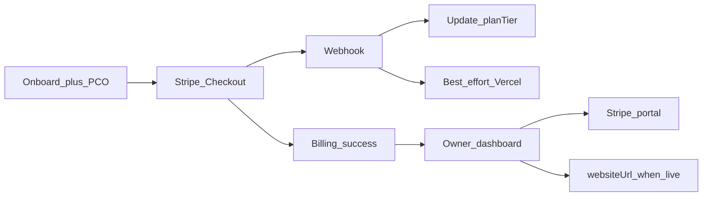

# Launch: owner home, site polish, PCO + auto-provision

## Locked decisions

- **Owner home** lives on [`/dashboard`](apps/web/src/app/dashboard/page.tsx) (membership-aware; platform staff keep Dev/Admin links).
- **Giving:** optional `Church.givingUrl`; public Give UI only when URL is set; editable from `/dev` and owner home.
- **Auto-provision:** best-effort on `checkout.session.completed`; failures logged; `/dev` remains fallback.
- **PCO:** persist tokens from onboard import onto the Church row.
- Marketing honesty copy edits are **out of scope** for this pass.

---

## 1. Schema + branding contract

**Prisma** ([`packages/database/prisma/schema.prisma`](packages/database/prisma/schema.prisma)):

- Add `givingUrl String?` on `Church` (next to `givingEnabled`).
- Run `db:push` / migrate as the repo normally does.

**Config** ([`packages/config/src/index.ts`](packages/config/src/index.ts)):

- Extend `ChurchBrandingSource` / `TenantBranding` with optional `givingUrl`.
- Map it in `toTenantBranding`.
- Public Give display rule (church-site): show only when `givingUrl` is non-empty (do not show stub copy).

**API update paths:**

- Include `givingUrl` in [`churchCreateInput` / `update`](packages/api/src/routers/church.ts) (dev).
- Expose `givingUrl` from `getPublicSite` (via branding or top-level field).

---

## 2. Owner home + login access

### Auth / login

[`apps/web/src/app/login/page.tsx`](apps/web/src/app/login/page.tsx) currently blocks anyone who is not platform admin/dev (except `/billing/*` callbacks). Change to also allow users with at least one church membership, then route them to `callbackUrl` (default `/dashboard`).

### Expand `auth.me`

[`packages/api/src/routers/auth.ts`](packages/api/src/routers/auth.ts): include on each membership church: `planTier`, `websiteStatus`, `websiteUrl`, `givingUrl`, `customDomain`, `mobilePlan`, `mobileBuildStatus`.

### New owner mutations (protected, OWNER/ADMIN)

In church (or billing-adjacent) router, reuse the same access pattern as [`assertChurchAccess`](packages/api/src/routers/billing.ts):

- `church.ownerGet` — full status for one church (optional if `me` is enough).
- `church.ownerUpdateGivingUrl` — set/clear `givingUrl` (validate URL; allow when `planAllowsGiving` or when already Growth/Custom).

Portal already exists: `billing.createPortalSession`.

### Dashboard UI

Rewrite [`apps/web/src/app/dashboard/page.tsx`](apps/web/src/app/dashboard/page.tsx):

| Audience                                   | Behavior                                                           |
| ------------------------------------------ | ------------------------------------------------------------------ |
| Unauthenticated                            | Sign-in CTA (not “staff only”)                                     |
| Owner/Admin membership, not platform staff | Owner home for their church(es)                                    |
| Platform admin/dev                         | Existing staff chrome + same church cards if they have memberships |

**Owner home cards (per church):**

- Name, slug, plan, role
- Website status + link when `websiteUrl` / LIVE
- Concierge copy when status is NONE / PENDING / DEPLOYING / FAILED
- Mobile status (read-only)
- **Manage billing** → `createPortalSession`
- **Giving URL** input + save (Growth/Custom)
- Support mailto (`NEXT_PUBLIC_SUPPORT_EMAIL`)

Keep layout simple (existing Card patterns); no CMS in this pass.

---

## 3. Billing success next steps

Update [`apps/web/src/app/billing/success/page.tsx`](apps/web/src/app/billing/success/page.tsx):

- Primary CTA: **Go to your church home** → `/dashboard` (session already exists after claimAndCheckout).
- Keep numbered “what happens next,” tighten to: payment confirmed → we provision site/apps → check dashboard for live URL.
- Secondary: support email link.
- Drop sole “Back to home” as the only action.

---

## 4. Church-site: locations/services + giving

[`apps/church-site/src/app/page.tsx`](apps/church-site/src/app/page.tsx):

- Destructure `locations` from `getPublicSite`.
- Add a **Locations & service times** section (name, address, weekly services using day labels). Skip empty.
- Replace Give stub: if `givingUrl` present, hero CTA + `#give` section link externally (`target="_blank" rel="noopener noreferrer"`). If absent, render nothing for Give (ignore `features.giving` alone).

---

## 5. PCO handoff at onboard

Today import only prefills locations; secret is cleared and never saved ([`PlanningCenterImport.tsx`](apps/web/src/components/onboard/PlanningCenterImport.tsx), [`church.onboard`](packages/api/src/routers/church.ts)).

- Extend `OnboardDraft` + `churchOnboardInput` with optional `planningCenterApiKey` / `planningCenterSecretKey`.
- On successful preview, keep credentials in draft (clear only the local secret input if desired, but draft must retain both for submit).
- On `church.onboard` create, persist keys onto the Church row.
- Brief copy in the import UI: “We’ll save these so we can sync events and groups after signup.”

Ongoing sync remains `/dev` (`syncPlanningCenter`) for this pass—no owner Sync button yet.

---

## 6. Best-effort auto-provision on checkout

[`apps/web/src/app/api/stripe/webhook/route.ts`](apps/web/src/app/api/stripe/webhook/route.ts):

After successful `applyStripeSubscriptionToChurch` on `checkout.session.completed`:

1. Load church by metadata / customer id.
2. If `websiteStatus === 'NONE'` (or FAILED with no `vercelProjectId`) and plan includes white-label site → call `provisionChurchWebsite` from [`packages/api/src/provision/vercel.ts`](packages/api/src/provision/vercel.ts).
3. Wrap in try/catch; `console.error` on failure; **do not** fail the webhook response (Stripe must get 200 after tier update).
4. Export `provisionChurchWebsite` from [`packages/api/src/index.ts`](packages/api/src/index.ts) for the webhook import.

`/dev` provision button unchanged as manual retry.

---

## 7. `/dev` giving URL field

[`apps/web/src/app/dev/churches/[slug]/page.tsx`](apps/web/src/app/dev/churches/[slug]/page.tsx): add `givingUrl` input next to `givingEnabled`; wire into existing update mutation.

---

## 8. Fulfillment checklist (dogfood)

Add [`docs/fulfillment-checklist.md`](docs/fulfillment-checklist.md) — internal runbook:

1. Marketing → Pricing → Onboard (with PCO import) → Subscribe (test Stripe)
2. Confirm webhook updated `planTier` + membership OWNER
3. Confirm auto-provision or manually Provision in `/dev`
4. Attach custom domain if needed
5. Run Planning Center sync in `/dev`
6. Open church-site (locations + giving URL if Growth)
7. Owner login → `/dashboard` status + portal + giving URL
8. Mobile: SHARED smoke or queue WHITELABEL note
9. Env prerequisites: `VERCEL_*`, `PLATFORM_API_URL`, Stripe live/test, PCO tokens

Dogfood one seeded/new church through this list before launch week.

---

## Out of scope (explicit)

- Marketing honesty rewrites
- Owner PCO sync button / scheduled sync
- Real in-product giving processor
- Sermon/announcement CMS UI
- Legal pages / seed-cred removal (separate P0)
