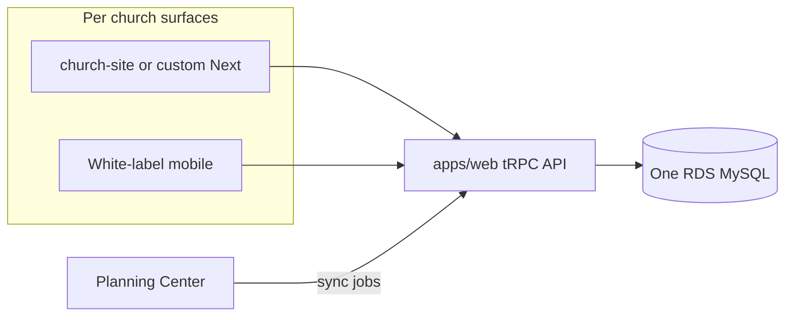

# Pricing structure, product packaging, and database tenancy

## Security note

Rotate the RDS password that was pasted in chat and keep credentials only in `.env` / secrets managers — never in docs or commits.

## Database decision: one shared RDS

**Keep a single AWS RDS MySQL database** (`church_stack`) with **row-level multi-tenancy via `churchId`**. Do not use schema-per-church or database-per-church.

Why this matches your product:

- Website + mobile already share one API/DB; events created once appear everywhere simultaneously — that is the correct model for “same exact DB.”
- Your codebase is already built this way ([`packages/database/prisma/schema.prisma`](packages/database/prisma/schema.prisma), `tenantProcedure` in [`packages/api/src/trpc.ts`](packages/api/src/trpc.ts)).
- Prisma + migrations stay simple; one migration path for all churches.
- Ops cost stays predictable as you grow from dozens to hundreds of churches.

When to reconsider later (not now): strict compliance demands true data isolation, or a mega-church that needs its own replica/scale — then offer an **Enterprise isolated DB** as a rare exception, not the default.

Do **not** confuse “one DB” with “one website deploy.” Per-church Vercel projects + custom domains are fine while they all hit the same API/DB.

## Product packaging (locked)

| Offer                  | What they get                                                                          | How it ships                                       |
| ---------------------- | -------------------------------------------------------------------------------------- | -------------------------------------------------- |
| **Platform core**      | Admin, content, events, announcements, PCO sync, branding                              | `apps/web` + shared API + shared DB                |
| **White-label site**   | Templated site from [`apps/church-site`](apps/church-site), on **their own domain**    | One Vercel project per church + domain attach      |
| **White-label mobile** | App under **church name** on App Store / Play                                          | Existing `MobilePlan.WHITELABEL` + EAS path        |
| **Custom site**        | Fully custom Next.js + custom features, still on shared platform DB/API, PCO if needed | Productized monthly tier (not one-off agency-only) |

Custom sites still use the **same church row and same DB** so mobile and site stay synced. Custom work is extra frontend/features on top of the platform, not a separate data silo.

## Recommended pricing tiers

Replace the current vague Starter/Growth/Network feature list on [`apps/web/src/app/pricing/page.tsx`](apps/web/src/app/pricing/page.tsx) with tiers that match what you actually sell. Keep price points in the same ballpark unless you later A/B test.

### Site — $79/mo (rename of Starter; raise from $49)

For a single church that wants a polished white-label web presence + white-label mobile.

- White-label website (`church-site`) on custom domain
- White-label iOS + Android app (church-named store listing)
- Announcements, events, locations, sermon series (flags as today)
- Planning Center sync (locations, events, life groups — once built)
- Email support
- Shared platform admin / onboard flow

**Add-on if needed:** extra campus / multi-location beyond a soft limit (e.g. 2 campuses included).

### Growth — $149/mo (rename features; raise from $99)

Everything in Site, plus:

- Giving integration (when wired)
- Priority support
- Richer site sections / more content types
- Faster white-label build SLA / store update cadence

### Custom — from $399/mo (productized; replaces vague “Network”)

Everything in Growth, plus:

- Fully custom Next.js website (scoped custom pages/features)
- Custom functionality beyond the template
- Planning Center + platform integrations as needed
- Dedicated support channel
- Still one `Church` tenant, same DB, same mobile app data

**Network / multi-church orgs:** sell as Custom with per-church seat pricing (e.g. Custom base + $79–149 per additional church), not a separate architecture.

### One-time fees (keep separate from MRR)

- App Store / Play developer account setup & first submission: fixed fee or included in Custom
- Custom site design kickoff (finite hours baked into first 1–2 months of Custom)

## Planning Center role

PCO is a **source of truth option**, not a second product database.

Today: PAT credentials on `Church`, campus/service-time **preview/import only** ([`packages/api/src/planning-center/`](packages/api/src/planning-center/), onboard UI). Marketing claims live sync of groups/events — not built yet.

Target model:

1. Store PCO credentials (or later OAuth) per church.
2. Sync jobs write into existing tenant tables: `Location`, `Event`, life groups (new model if needed), etc., all keyed by `churchId`.
3. Optional `externalId` / `source = PLANNING_CENTER | MANUAL` so manual edits and PCO rows can coexist without duplicates.
4. Website + mobile read only from your DB — never call PCO from the client.

Churches without PCO keep using Church Stack as CMS. Churches with PCO get pull/sync; both surfaces stay simultaneous because they share the DB.

## Custom domain for white-label sites

Already stored: `Church.customDomain`. Provisioning sets `websiteUrl` but does **not** attach DNS yet ([`packages/api/src/provision/vercel.ts`](packages/api/src/provision/vercel.ts)).

Product promise for Site+: church owns the domain; platform attaches it to their Vercel project ( Domains API + DNS instructions). Default fallback: `*.churchstack` or Vercel URL until DNS propagates.

## What not to change in architecture

- Do not give each church its own RDS instance for the default product.
- Do not put mobile on a different database or sync layer.
- Do not build custom sites as disconnected static sites with their own MySQL — they should call the same tRPC API with that church’s slug/id.

## Implementation backlog (when you leave plan mode)

Ordered so pricing claims stay honest:

1. **Schema/product flags** — e.g. `planTier` (`SITE | GROWTH | CUSTOM`) alongside existing `mobilePlan` / website fields; enforce feature gates in API.
2. **Pricing page copy** — update tiers/prices/features to match this model.
3. **Custom domain attach** — complete Vercel domain provisioning + owner DNS docs.
4. **PCO sync v1** — persist campuses; add events + groups sync with `externalId`.
5. **Billing** — Stripe subscriptions mapped to the three tiers (currently marketing-only).
6. **Custom site delivery** — repo/template or per-customer Next app that still uses `@repo/api` + `churchId`, sold as Custom MRR.

## Verdict (short)

- **One RDS, many churches via `churchId`.**
- **Site/Growth = white-label `church-site` + white-label mobile on their domain/store listing.**
- **Custom = productized monthly custom Next.js, same platform DB.**
- **PCO syncs into your DB; web and mobile always read the same tenant data.**
