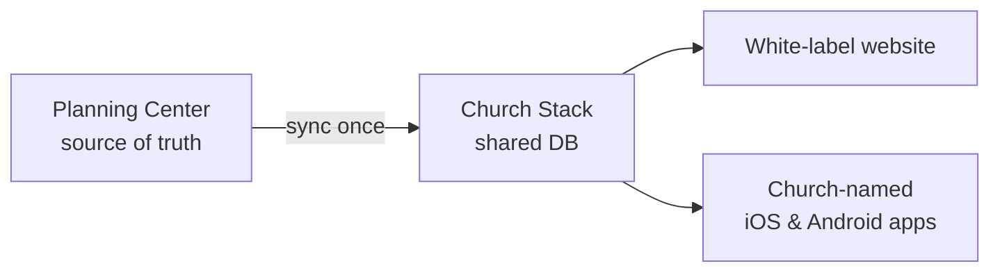
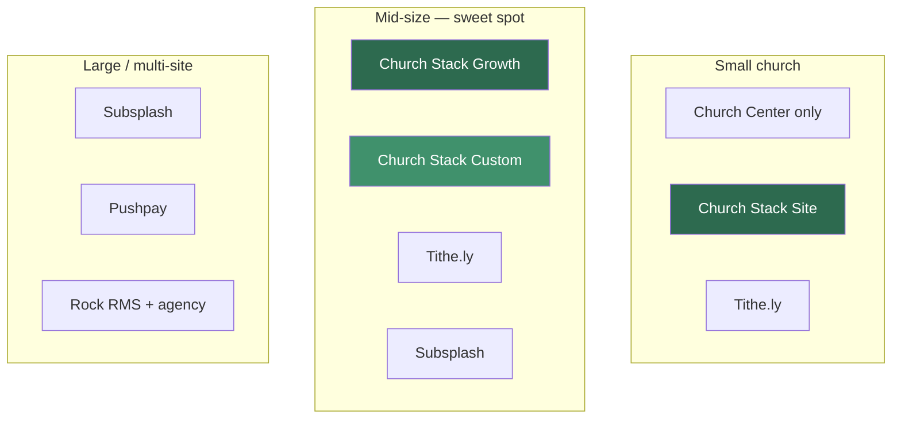
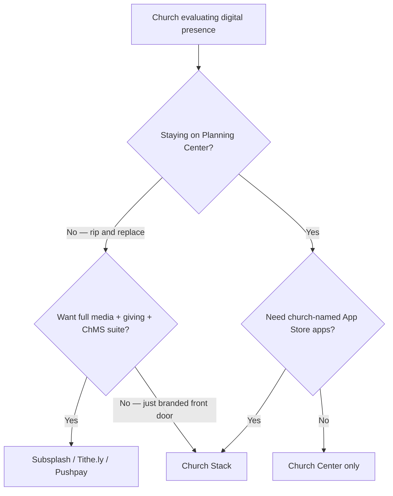

# Church Stack — Positioning

> **Church Stack = branded site + church-named apps on one database, built for churches that already live in Planning Center (or want that simplicity) — without buying a full Subsplash / Tithe.ly / Pushpay ecosystem.**

This doc maps competitors, win/lose rules, and the ICP to optimize for.

---

## Core wedge

We are **not** a ChMS replacement. We are the branded front door: update once in PCO (or in Church Stack), publish everywhere.

| Tier       | Price        | Role                                          |
| ---------- | ------------ | --------------------------------------------- |
| **Site**   | $129/mo      | Website + church-named apps + PCO sync        |
| **Growth** | $249/mo      | + giving + priority support                   |
| **Custom** | From $599/mo | Custom Next.js site, same shared DB as mobile |

---

## One-line pitch

> Your Planning Center data, on a website and church-named apps that actually look like _your_ church — without switching platforms.

---

## Key selling points (in order)

1. **Your church’s name in the App Store** — not Church Center, not a shared template brand. Identity, not just utility.
2. **Update once, live everywhere** — PCO (or Church Stack) → one database → website + iOS + Android stay in sync. Kills double entry.
3. **Keep Planning Center** — no rip-and-replace ChMS. You’re a layer on top, not a migration project.
4. **Site + app as one product** — not a pretty website that drifts from the app, or an app bolted onto a random WordPress theme.
5. **Live in days, clear pricing** — $129 / $249 vs enterprise quotes and multi-month agency builds.
6. **Custom when you outgrow templates** — Custom Next.js still on the same content pipe as mobile (SEO + design without splitting systems).
7. **Lower lock-in story** — buy a branded front door; don’t move giving, people, and services into someone else’s suite.

---

## Matrix 1 — Church size × stack preference

|                | Wants “good enough” free/cheap    | Wants branded app + site, keep PCO    | Wants one vendor for everything | Wants custom / owns the stack    |
| -------------- | --------------------------------- | ------------------------------------- | ------------------------------- | -------------------------------- |
| **<150**       | Church Center, Breeze, ChurchTrac | **You (Site $129)**                   | Tithe.ly                        | Rarely worth it                  |
| **150–800**    | Church Center + DIY site          | **Your sweet spot (Growth $249)**     | Tithe.ly / Subsplash            | **You (Custom) or Rehost-style** |
| **800–2,000+** | Uncommon                          | You only if PCO-loyal + hates lock-in | **Subsplash / Pushpay**         | Rock RMS + agency / Pushpay      |

**Read:** primary win zone is **branded app + site, keep PCO**, mid-size row. Do not try to beat Pushpay on enterprise giving or Subsplash on media/TV apps.

---

## Matrix 2 — Job-to-be-done vs who wins

| Job the church is hiring for                     | Default winner today                   | When **you** win instead                                                         |
| ------------------------------------------------ | -------------------------------------- | -------------------------------------------------------------------------------- |
| “Members need events/groups on a phone”          | Planning Center Church Center          | They want **their church’s name** in the App Store, not “Church Center”          |
| “We need a real website that ranks”              | The Church Co / Nucleus / WordPress    | They also want the **same content in a native app**                              |
| “App + giving + livestream + media in one login” | **Subsplash**                          | They already pay for PCO + a giver and refuse another mega-suite                 |
| “Maximize online giving & donor ops”             | **Pushpay** / Tithe.ly                 | Giving is secondary; brand/presence is primary (**Growth** only)                 |
| “Stop double-entering events”                    | Subsplash↔PCO or stay in Church Center | **PCO is source of truth**; site + app are publish surfaces                      |
| “Custom site, not a church template”             | Agency / DIY Next.js                   | **Custom tier**: custom Next.js **still wired to the same DB as the app**        |
| “Own the code / App Store account forever”       | Rehost / Buildify / custom shop        | You win on **speed + productized pricing**; they win on pure ownership narrative |

---

## Matrix 3 — Competitive scorecard

Scale relative to _your wedge_ (not absolute product quality): **Strong / OK / Weak / N/A**.

| Dimension                     | Church Stack      | Subsplash           | Tithe.ly           | Pushpay            | Church Center (PCO) |
| ----------------------------- | ----------------- | ------------------- | ------------------ | ------------------ | ------------------- |
| Church-named native apps      | Strong            | Strong              | Strong             | Strong             | Weak (shared brand) |
| White-label website           | Strong            | Strong              | Strong             | OK                 | N/A                 |
| PCO as source of truth        | Strong            | OK                  | OK                 | OK                 | Strong (native)     |
| One shared DB (site ↔ app)    | Strong            | Strong (own stack)  | Strong (own stack) | Strong (own stack) | N/A                 |
| SMB transparent pricing       | Strong ($129–249) | Weak (quote/bundle) | Strong             | Weak               | Strong (modular)    |
| Giving depth                  | OK (Growth+)      | Strong              | Strong             | Strong             | OK                  |
| Media / livestream / TV       | Weak (today)      | Strong              | OK                 | OK                 | Weak                |
| ChMS replacement              | Weak (by design)  | OK–Strong           | Strong             | Strong             | Strong              |
| Custom Next.js / SEO story    | Strong (Custom)   | Weak                | Weak               | Weak               | N/A                 |
| Switching cost / lock-in fear | Lower (companion) | High                | High               | High               | Low (already there) |

---

## Competitors at a glance

### Biggest direct (same job: branded app + digital presence)

| Player              | Why they matter                         | Typical positioning                                 |
| ------------------- | --------------------------------------- | --------------------------------------------------- |
| **Subsplash**       | Usually cited as #1 church app platform | All-in-one: app, website, media, livestream, giving |
| **Tithe.ly**        | Strong mid-market / SMB pull            | App + website + giving + ChMS; often “best value”   |
| **Pushpay** (+ CCB) | Premium / larger-church leader          | High-end giving + engagement + branded apps         |

### Adjacent giants

| Player                             | Relationship                                                                                        |
| ---------------------------------- | --------------------------------------------------------------------------------------------------- |
| **Planning Center**                | Partner _and_ soft competitor — Church Center covers many churches that never buy a white-label app |
| **Rock RMS**                       | Custom ChMS for larger churches; apps/sites often built around it                                   |
| **Breeze, ChurchTrac, One Church** | Cheaper all-in-ones with a site/app so churches skip a separate stack                               |

### Closer lookalikes

- **Ministry One**, **Go Church App**, **Custom App Press** — white-label church apps
- **Rehost / Buildify**-style shops — custom-coded apps (~$250/campus), ownership narrative
- **Website specialists** (The Church Co, Nucleus, Clover Sites, Ekklesia360) — compete on site; some integrate with PCO

---

## Win / lose rules

### You win when they say

- “We’re staying on Planning Center.”
- “We want _Grace Church_ in the App Store, not Church Center.”
- “I’m tired of updating the website _and_ the app.”
- “Subsplash/Pushpay feels like buying a second operating system.”
- “We need something live before next month / next launch Sunday.”
- Size roughly **150–1,000**, 1–5 campuses, staff isn’t a full digital team.

### You lose (don’t fight) when they say

- “We want one vendor for giving, media, livestream, and ChMS.” → Subsplash / Tithe.ly / Pushpay
- “Church Center is fine; members already have it.” → stay with PCO
- “Donor analytics and text-to-give are the product.” → Pushpay
- “We need sermon TV apps and a media empire.” → Subsplash
- “We want source code in our GitHub.” → Rehost / Buildify niche
- Multi-site mega-church with procurement → Pushpay / Rock

---

## Elevator frames vs each big name

| Competitor                | Frame                                                                                                                                                               |
| ------------------------- | ------------------------------------------------------------------------------------------------------------------------------------------------------------------- |
| **vs Subsplash**          | Same branded presence, without ripping out PCO or paying for a media suite you won’t use.                                                                           |
| **vs Tithe.ly**           | If giving + ChMS consolidation is the goal, they win. If **PCO stays** and you want a sharper site+app layer, you win.                                              |
| **vs Pushpay**            | They’re enterprise engagement/giving. You’re the mid-church brand layer at a fraction of the complexity.                                                            |
| **vs Church Center**      | Free and good enough for logistics. You sell **identity + owned channels** (domain + church-named apps) when Church Center feels like a utility, not _their_ brand. |
| **vs website-only shops** | A pretty site that doesn’t sync to the app is half a product.                                                                                                       |
| **vs custom app shops**   | Same “yours” feeling, productized: days not months, clear tiers, shared platform.                                                                                   |

---

## ICP

### Primary

Mid-size church (**~150–800**), already on **Planning Center**, wants church-named iOS/Android + a real site, hates double entry, budget **~$129–249/mo**, not shopping for a new ChMS.

### Secondary

Multi-campus / design-forward churches that want **Custom Next.js** but still one content pipe into mobile (**Custom $599+**).

### Avoid as primary ICP

- Mega-churches buying Pushpay for giving ops
- Churches whose #1 pain is livestream/media
- Churches with zero ChMS that want an all-in-one

---

## Strategic implication

Your wedge isn’t “better church software.” It’s:

> **The branded front door for churches that already run ministry in Planning Center.**

That keeps you out of a head-on war with Subsplash/Pushpay on ecosystem depth, and makes Church Center the objection you must answer clearly (“utility vs _your_ brand”), not ignore.
